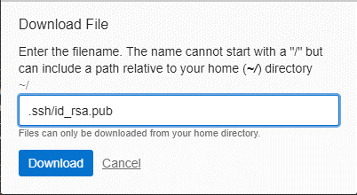

## Exercício 1 – Criando a Chave SSH

**PASSO 1** - Acesse o OCI Cloud Shell clicando no botão do menu superior direito.O OCI irá provisionar um terminal Linux no web browser


**PASSO 2** - Crie um par de chaves RSA com o  comando: 
```python
ssh-keygen -t rsa
```
Mantenha o nome original "id_rsa", apertando **enter**. **O campo “Key Passphrase” é opcional**


**PASSO 3 –**  Exiba o conteúdo da chave pública que você criou utilizando o comando:
```python
cat ~/.ssh/id_rsa.pub
```
**Selecione e copie o conteúdo dessa chave**, pois a usaremos para a criação das máquinas virtuais Linux.


Para a criação da VM, usaremos a chave pública. A chave privada será usada apenas para conexão.

**PASSO 4 –**  **Baixe as duas chaves também no seu computador**. Salve as chaves privadas e públicas em um local seguro. Para isso, basta clicar no menu do Cloud Shell e solicitar o Download:


 Para baixar a chave pública, o caminho é:
 ```python
.ssh/id_rsa.pub
```




Para baixar a chave privada, o caminho é:

```python
.ssh/id_rsa
```


## Exercício 2 – Criando a VM Linux

**PASSO 1 -**  No Menu Principal, clique em : Compute > Instances, então “Create Instance” (Botão Azul) :

**Name you instance**: VM-OracleLinux-AD1

**Availability Domain**: AD 1

**Operating System**: Oracle Linux 7.9

**Instance Type**: Virtual Machine

**Instance Shape**: AMD VM.StandardE2.1

**Choose SSH Key File**: Insira a chave SSH pública (.pub)

**Virtual Cloud Network Compartment**: `<Seu-Compartimento>`

**Virtual Cloud Network**: `<Sua-VCN>`

**Subnet Compartment**: `<Seu-Compartimento>`

**Subnet**: Public Subnet

**Assign Public IP Address**
Lembre-se de escolher o AD certo e seu Compartimento.


**PASSO 2 -**  Depois de expandir as opções de Shapes e Network, insira os dados necessários para concluir o processo de criação:


**PASSO 3 –**  Para alterar as informações de rede, clique em “Edit”. Ao inserir as informações de rede, lembre-se de escolher a opção “**Assign a Public IP address”** para atribuir um endereço IP público à instância de computação.


**PASSO 4 –**  Cole a chave pública SSH criada por você anteriormente e clique no botão “Create”.


Você provavelmente terá a nova instância devidamente criada em alguns minutos. Depois de terminar o processo de criação, a tela principal ficará assim:


## Exercício 3 – Acessando a VM através do CloudShell

**PASSO 1 -**  Primeiro passo: Pegue o IP Público da Instância


**PASSO 2 -**  No OCI Cloud Shell, faça conexão com a máquina criada com o comando:
```python
ssh opc@<ip-público>
```
O usuário default nas instâncias Oracle Linux é **opc**


## Exercício 4 – Criando um Instance Pool com Autoscaling Policy

**PASSO 1:** Para criar uma configuração de instância, você pode seguir as etapas abaixo:
Entre na Instância que deseja copiar a imagem e clique em “More Actions”:


Escolha o nome da Instance Configuration


 **PASSO 2:** Depois de criar sua instance configuration, você poderá criar seu Instance Pool.

 


**PASSO 3:** O pool de instâncias criará as instâncias de computação que serão usadas para receber a carga do aplicativo.


**PASSO 4:** Clique no botão Avançar e insira informações de AD / FD / Rede para o Pool:


**PASSO 5:** Concluindo o assistente, seu pool será provisionado. Observe que o número de instâncias no pool determinará o tempo necessário para a criação.
Após o provisionamento, o Pool se parecerá com a seguinte tela:


**PASSO 6:** Na tela Instance Pool, você pode criar a política de escalonamento automático.


**PASSO 7:** Forneça o nome da política, o pool de instâncias que será usado

O OCI possibilita 2 tipos de políticas de Autoscaling :

 - Metric Based – Baseada em métricas de utilização dos recursos do pool
   Schedule-based Autoscaling – Baseada em agendamento:


**PASSO 8:** para este exercício, usaremos a escala automática "Metric-based".


**PASSO 9:** Na segunda parte da tela, você pode especificar os limites da política para ações de pesquisa (aumentar e diminuir)


Após concluir os limites da política de autoscaling, finalize a criação do Autoscaling Configuration.

**PASSO 10:** Agora que temos todos os componentes de escalonamento configurados, podemos começar a “estressar” o pool de recursos e testar a política de escalonamento. Para isso, utilizaremos a ferramenta “stress”


**PASSO 11:** **É importante observar que a sobrecarga da CPU deve ser criada na VM do pool de instâncias, não no servidor APP original.**

Para monitorar o uso da CPU no pool, você pode usar a tela principal do “Metrics Explorer”.


**PASSO 12:** Estabeleça uma conexão SSH com a instância do Pool pelo IP Público ou configurando um Bastion Service e utilize os comandos:

```python
sudo su –
rpm -Uvh https://dl.fedoraproject.org/pub/epel/epel-release-latest-7.noarch.rpm
yum install stress -y
stress --cpu 20 --timeout 12000
```


**PASSO 12.1:** Após 5 minutos de estresse da CPU, o pool de instâncias implantou uma nova VM no pool, como você pode ver, o pool tem 2 instâncias:


**PASSO 13:** À medida que a CPU continua sob estresse, outra instância de computação é provisionada.


**PASSO 14:** 5 minutos após o término do estresse da CPU, o pool de instâncias retornou à configuração original:


**PASSO 15:** Você pode acompanhar todas as atividades do Pool através do link “Work Request”, no lado esquerdo da tela:


Parabéns! Você concluiu este lab!