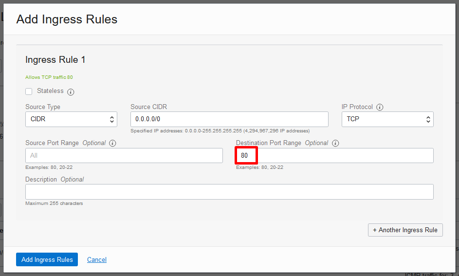

# Load Balancer - Parte 1

## Instalando a aplicação de teste nos 2 Webservers Linux


####  PASSO 1 - Siga as etapas abaixo para instalar o aplicativo Apache em servidores Linux:

Instalar Apache Application Server em cada servidor:
 (**OBS: As etapas de 1 a 5 são iguais para ambos os servidores, mas a etapa 6 é diferente!**):

 1. Conecte-se no host Linux usando o usuário opc
 2. Uma vez conectado, mude seu usuário para ROOT com o comando: **sudo su –**
 3. Instale o pacote Apache no sistema operacional: **sudo yum install httpd -y**
 4. Inicie o aplicativo Apache : **sudo apachectl start**
 5. Configure o firewall do host local para permitir o tráfego do Apache, para isso use os comandos abaixo no Linux:

```python
sudo systemctl enable httpd
sudo apachectl configtest
sudo firewall-cmd --permanent --zone=public --add-service=http
sudo firewall-cmd --reload
sudo su -
```

Para identificar a primeira instância de computação usada na interface web (Linux -  AD2), personalize o arquivo “index.html”. Use o seguinte comando como usuário ROOT:

```python
cat <<EOF > /var/www/html/index.html
```

```python
<!DOCTYPE html>
<html lang="pt-br">
<head>
<meta charset="UTF-8">
<meta name="viewport" content="width=device-width, initial-scale=1.0">
<title>OCI FAST TRACK: Webserver 1</title>
</head>
<body>
    <center> 
    <h1>Load Balancer Webservers</h1>
    <center> 
</body>
</html>
EOF
```

#### PASSO 2 - Na segunda instância você repetirá as etapas acima, **de 1 a 5**, para identificarmos a segunda instância de computação (Linux – AD3) personalize o arquivo “index.html” usando o seguinte comando com usuário ROOT:

```python
cat <<EOF > /var/www/html/index.html
```

```python
<!DOCTYPE html>
<html lang="pt-br">
<head>
    <meta charset="UTF-8">
    <meta name="viewport" content="width=device-width, initial-scale=1.0">
    <title>OCI FAST TRACK: Webserver 2</title>
</head>
<body>
    <center> 
        <h1>Load Balancer Webservers</h1>
    <center> 
</body>
</html>
EOF
```

Teste o comportamento do Apache, tudo que você precisa fazer, é **usar o IP público da instância** do Compute no seu navegador web para verificar se a página principal do Apache aparecerá.

#### PASSO 3 - Teste o comportamento do Apache, tudo que você precisa fazer, é **usar o IP público da instância** do Compute no seu navegador web para verificar se a página principal do Apache aparecerá.


**ATENÇÃO**: Antes de testar o Apache em seu navegador web, certifique-se de já ter criado uma regra de entrada (ingress) na **Security List do VCN**, para que a porta 80 seja liberada para tráfego.



Se tudo estiver OK, você pode testar a instalação do Apache. Tudo o que você precisa fazer é usar o endereço IP da instância pública em seu navegador preferido e provavelmente obterá esta saída:


**IMPORTANTE:** Certifique-se de iniciar a criação do Load Balancer somente depois que ambas as chamadas no apache estiverem funcionando. Isso é importante porque se você criar o Load Balancer sem um serviço disponível, o balanceador de carga será criado no estado de “Erro”. O Load Balancer geralmente leva 5 minutos para "calibrar" seu status.

Nosso objetivo é criar o serviço de Load Balancer somente depois que os dois servidores Apache estiverem em execução, para que o serviço Load Balancer tenha o estado "pronto" e esteja pronto para ser testado.

 


# Load Balancer - Parte 2

## Criando uma aplicação em Alta Disponibilidade (HA) com Load Balancer e 2 Webservers


#### PASSO 1 -  Para acessar a interface do Load Balancer, mais uma vez, vamos começar a partir do “Menu Principal > Load Balancers”


Clique no botão “Create Load Balancer”:


### Criando um Load Balancer

#### PASSO 2 -  A tela de criação do Load Balancer é um modelo baseado em assistente, onde você será guiado no processo pela interface. Na tela principal, você fornecerá as informações abaixo:
 - Name: lb-apache
 - Visibility Type: Public
 - Bandwidth: 10 Mbps
 - VCN: `<Selecione sua VCN>`
 - Subnet: `<Selecione sua sub-rede pública>`


#### PASSO 3 -  Defina a política do Load Balancer e adicione os servidores de back-end. Para adicionar servidores de back-end, clique no botão azul “Add Backends”


#### PASSO 4 -  Insira os Backend Set servers (suas duas VM’s Linux):


#### PASSO 5 -  Como última etapa, defina o tipo de tráfego que será tratado


#### PASSO 6 -  Clique em Submit


Assim que o processo de criação for concluído, você terá as seguintes informações:


### Testando o Load Balancer

#### PASSO 5 - Para simular um ambiente de aplicativo, precisamos iniciar um serviço da web em ambas as instâncias de Computação.

Para obter saídas diferentes nas chamadas do Load Balancer, adicione conteúdos diferentes ao arquivo Index.html em cada cálculo


#### PASSO 6 – Utilize o IP Público do Load Balancer para visualizar sua aplicação sendo direcionada para os 2 servidores com respostas diferentes no arquivo Index.html

Veja o Resultado:

 


Parabéns! Você concluiu este lab!