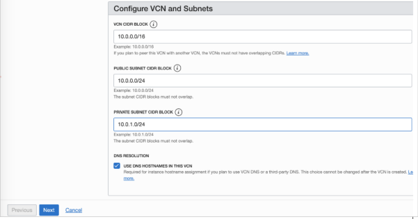

# LAB #2 – Networking

**Objetivos**

• Criar 2 VCNs  
• Criar um Local Peering Gateway entre 2 VCNs  

## Exercício 2a: Criando 2 VCNs

PASSO 1: Para criar uma rede, lembre-se de escolher seu compartimento e, em seguida, aperte: 

Networking >> Virtual Cloud Networks, no menu principal.  

PASSO 2: Para criar as 2 VCNs iremos utilizer o “Start VCN Wizard”

PASSO 3: Escolha a VCN com Conectividade com a Internet

PASSO 4: Coloque as informações para a criação da VCN:

**VCN 1**  
Nome: VCN-HUB  

Compartment: Networking  

VCN CIDR Block: 10.0.0.0/16  

Public Subnet: 10.0.0.0/24  

PrivateSubnet: 10.0.1.0/24  

Siga o processo de instalação até estar finalizado

Após finalizado, você terá as informações da VCN criada

PASSO 5: Siga o mesmo fluxo do Passo 4 para criar mais 1 VCNs, com as configurações:

**VCN 2**  
Nome: VCN-PROD  

Compartment: Networking  

VCN CIDR Block: 172.16.0.0/16  

Public Subnet: 172.16.0.0/24  

PrivateSubnet: 172.16.1.0/24  

## Exercício 2B: Conectando 2 VCNs com Local Peering Gateway

PASSO 1: Acesse sua VCN-PROD. 
No menu lateral clique em“Local Peering Gateway”  

PASSO 2: Clique em “Create Local Peering” e dê o nome de: **LPG-PROD-HUB**

O seu LPG será criado imediatamente, mas ainda sem nenhuma conexão

PASSO 3: Faça os mesmos passos acima (1 e 2) para criar um LPG na sua VCN-HUB.  

Na criação desse LPG, coloque o nome: LPG-HUB-PROD  

PASSO 4: Agora iremos parear os dois Local Peering Gateways criados, para isso, clique nos 3 pontos laterais e escolha “Establish Peering Connection”

PASSO 5: Selecione o LPG destino, ou seja, o LPG criado na VCN-PROD, e a LPG-PROD-HUB em “Unpeered Peer Gateway” e clique em “Establish Peering Connection”

Rapidamente o Status passará para “Peered”, com a rota feita.

PASSO 6: Agora iremos liberar o tráfego entre as redes privadas através da criação de uma regra de rota na Route Table. 

Para isso selecione a Route Table no menu lateral. 

Vamos começar pela VCN-HUB

PASSO 7: Selecione a “Route Table for Private Subnet-VCN-HUB”. 

Clique em “Add Route Rules” e configure uma regra de rota conforme abaixo:

Target Type: Local Peering Gateway  

Destination CIDR Block: 172.16.0.0/16  

Target Local Peering Gateway in HUB: LPG-HUB-PROD  

PASSO 8: Faça as mesmas coisas na VCN-PROD. 

Para isso vá na VCN-PROD, no menu lateral selecione “Route Tables” e clique em “Route table” e crie a regra abaixo:

Target Type: Local Peering Gateway  

Destination CIDR Block: 10.0.0.0/16  

Target Local Peering Gateway in HUB: LPG-PROD-HUB  

PASSO 9: Para finalizar, precisamos liberar as regras de segurança para que as VCNs se conversem através da rede privada. 

No menu lateral selecione “Security Lists” e clique em “Security List for Private Subnet-VCN-PROD”

PASSO 10: Clique em “Add Ingress Rules” e crie a regra abaixo:

Source CIDR: 10.0.0.0/16  

IP Protocol: All Protocols  

PASSO 11: Libere as regras na Security list da VCN-HUB também. 

Para isso vá ao VCN HUB, selecione a VCN-HUB, no menu lateral selecione “Security Lists” e clique em “Security List for Private Subnet-VCN-HUB” e crie a regra abaixo:

Source CIDR: 172.16.0.0/16  

IP Protocol: All Protocols  

Você pode ver o resultado final no “Network Visualizer”

Parabéns! Você concluiu este lab!

